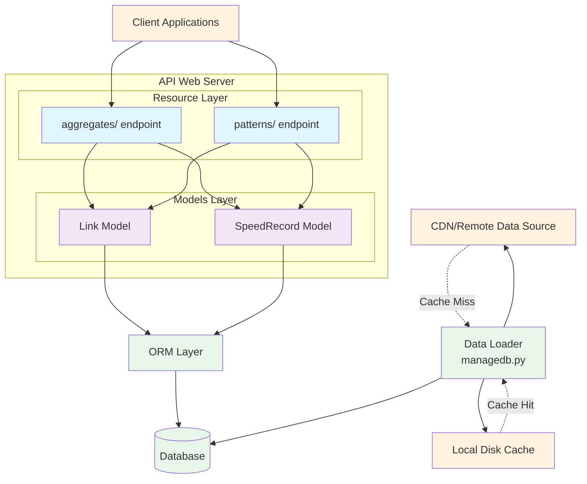

# urbansdk-takehome

TODO:
- [x] fetch data files from cdn
- [ ] move logic from views to service layer
- [ ] clean up any commented out code and todos
- [x] split up models into db models and view models
- [ ] check project structure
- [x] convert periods and days of week back to strings in response
- [x] move db management script to the top level, and maybe wrap it in a shell script
- [x] split out config to multiple files
- [x] make sql async
- [x] fix spatial filter. Not getting any results
- [ ] set instructions for how to run everything in readme
- [ ] review spec doc to make sure not missing anything
- [ ] make some notes in the final readme about what could be done differently/better
- [ ] fix the slow link query
    - moving logic out of the views


-----------------

Setup
-----

#### Python
Setup a python virtual environment. For this project I'm running Python 3.12 and using pyenv for my environment management.
pip-compile is also needed (`pip install pip-tools`) for good measure when installing dependencies.

#### Environment
Some environment variables are needed when running db commands, running the server or starting docker. Create a `.env` file 
similar to this.
```dotenv
DB_PASS=password
DB_USERNAME=admin
DB_HOST=localhost
DB_NAME=geo_db
```

#### Dependencies
Dependencies can be installed with the `install` make target. This project has a Makefile with some simple
targets for convenience. You'll see them referenced throughout.
```bash
make install
```

#### Docker
A postgis docker image to spin up a local postgres db. You'll find a `compose.yaml`
file at the root.
```bash
docker compose up -d
```

### Database
----
At the root of the project there is a `managedb.py` script for basic management of the db tables and data loading.

#### Creating tables
Once the docker container is up and running you can create the database tables needed for the app with 
the `create-tables` target. This will create the `links` and `speeds` tables.
```bash
make create-tables
```

#### Dropping tables
To drop the tables simply run the `drop-tables` target.
```bash
make drop-tables
```

#### Loading data
To load the data, run the `load-data` target. This will fetch the links and speeds parquet files from the cdn
and cache them locally in a directory called `data/` for subsequesnt database loads.
```bash
make load-data
```

### Running the Server
----
The server can be started with the `run` target
```bash
make run
```

### Extras
----
- if any changes to the requirements.txt file are needed, add them in requirements.in file and run `make install` again
- `make uninstall` will uninstall all dependenices (event pip-tools, so you'll have to reinstall it)
- `make format` will run black and isort against the code to format it

### Architecture
----





### Sudmission Notes
----
- I was unable to get the jupyter notebook to function properly. I think there was a versioning issue.
It was already the 11th hour and I was too far in to turn back, so unfortunately I wasn't able to make any nice visuals.

